# Sistema de Gestión para Ferretería

Este repositorio contiene el código fuente y la documentación para un sistema web de gestión de ferreterías, desarrollado como un proyecto académico para la Universidad Autónoma de Yucatán.

## Tabla de Contenidos

- [Descripción del Proyecto](#descripción-del-proyecto)
- [Prototipos de Interfaz](#prototipos-de-interfaz)
- [Características](#características)
- [Arquitectura y Tecnologías](#arquitectura-y-tecnologías)
- [Estructura del Repositorio](#estructura-del-repositorio)
- [Cómo Compilar y Ejecutar](#cómo-compilar-y-ejecutar)
- [Documentación](#documentación)

## Descripción del Proyecto

El objetivo es crear una aplicación web robusta que permita a los administradores de una ferretería gestionar eficientemente las operaciones diarias, desde el control de inventario y ventas hasta la gestión de proveedores y la generación de reportes.

## Prototipos de Interfaz

Se han desarrollado dos versiones de prototipos de la interfaz de usuario:

- **[Versión Base](https://claude.ai/design/p/ad00462b-adfc-4cff-99eb-1697f41224ae?file=Sistema+Ferreteria.html&via=share)** — Adaptación que se alinea con los requisitos y diagramas actuales del proyecto.
- **[Versión Mejorada](https://claude.ai/design/p/8f2fd7be-6c51-4486-8899-a5adfb610eef?file=Sistema+Ferreteria.html&via=share)** — Versión con mejoras adicionales identificadas durante el diseño que van más allá de los requisitos actuales.

## Características

El sistema contará con los siguientes módulos principales:

- **Inventario:** Gestión del catálogo de productos, control de niveles de stock y alertas de existencias bajas.
- **Ventas:** Procesamiento de transacciones de venta y generación de recibos.
- **Compras:** Creación y seguimiento de órdenes de compra a proveedores.
- **Proveedores:** Registro y administración de la información de contacto de los proveedores.
- **Clientes:** Mantenimiento de un registro de clientes y su historial de compras.
- **Reportes:** Generación de informes de ventas e inventario (diarios, mensuales, anuales).

## Arquitectura y Tecnologías

- **Backend:** Java
- **Frontend:** HTML, CSS y JavaScript
- **Arquitectura:** El proyecto sigue un patrón de diseño MVC (Modelo-Vista-Controlador) para separar la lógica de negocio, los datos y la presentación.

## Estructura del Repositorio

```
.
├── docs/               # Documentación del diseño (requisitos, diagramas UML, etc.)
├── sistema/            # Raíz del proyecto Maven
│   ├── pom.xml         # Archivo de configuración de Maven
│   └── src/
│       ├── main/
│       │   └── java/
│       │       └── com/
│       │           └── proyecto/
│       │               ├── controller/
│       │               ├── model/
│       │               ├── service/
│       │               └── Main.java   # Punto de entrada de la aplicación
│       └── test/       # Pruebas unitarias
└── README.md           # Este archivo
```

## Documentación

Toda la documentación de análisis y diseño se encuentra en la carpeta [`docs/`](docs/). A continuación se detallan los documentos clave:

- **Requisitos:** [requisitos.md](docs/requisitos.md) - Requisitos funcionales y no funcionales.
- **Historias de Usuario:** [historiasUsuario.md](docs/historiasUsuario.md) - Historias de usuario con criterios de aceptación.
- **Diagramas de Clases:** [diagramasClases.md](docs/diagramasClases.md) - Diagramas de clases del sistema (en progreso).
- **Diagramas de Casos de Uso:** [diagramaCasosUso.md](docs/diagramaCasosUso.md) - Diagramas de casos de uso (pendientes).
- **Diagramas de Actividad:** [diagramasActividad.md](docs/diagramasActividad.md) - Diagramas de actividad (pendientes).
- **Diagramas de Secuencia:** [diagramasSecuencia.md](docs/diagramasSecuencia.md) - Diagramas de secuencia (pendientes).
