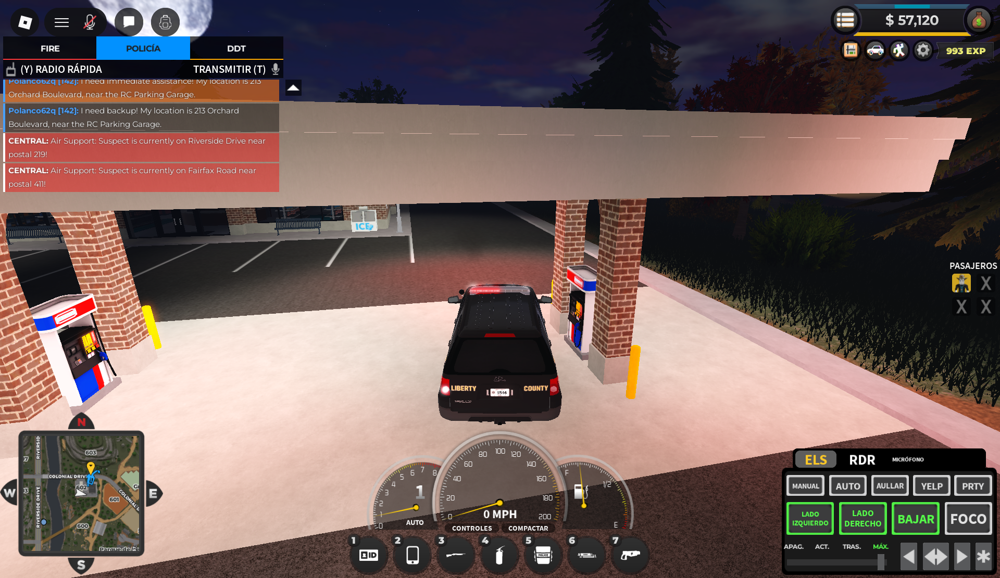

## Prueba Diagrama de clases 
Hola esta es mi prueba aqui subire la explicacion del diagrama de clases que se vera modificado despues.

###Patrones de diseño

##1. Patrón Singleton 

En el diagrama se usa el patrón Singleton para manejar el inventario. La idea es que solo exista una única instancia de la clase encargada del stock, ya que tener varias podría provocar inconsistencias en las existencias (por ejemplo, productos duplicados o mal actualizados).

Esto se logra con un atributo estático privado que guarda la instancia y un método público estático (getInstance()) que permite acceder a ella. De esta forma, cualquier parte del sistema trabaja siempre con la misma fuente de información, manteniendo el control del inventario centralizado y consistente.

##2. Patrón Strategy (en la interfaz GenerarDescuento)

También se aplica el patrón Strategy para manejar los descuentos dentro de las ventas. En lugar de poner múltiples condiciones dentro de la clase Venta para decidir qué tipo de descuento aplicar, esa responsabilidad se delega a una interfaz.

Así, cada tipo de descuento se implementa en una clase distinta (por ejemplo, DescuentoPorcentaje o SinDescuento), lo que permite cambiar o agregar nuevas formas de calcular descuentos sin modificar la lógica de la venta.

Esto hace que el sistema sea más flexible y fácil de mantener. Por ejemplo, si en el futuro se quiere agregar un “Descuento por Buen Fin”, basta con crear una nueva clase que implemente la misma interfaz, sin afectar el código existente.